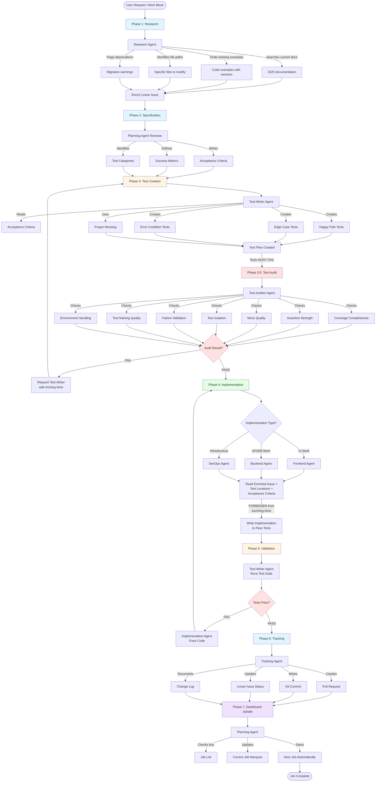

# TDD Workflow Guide

**Purpose**: Complete test-driven development workflow guide with multiple workflow options for different scenarios
**Related Prompts**: planning-agent.md, frontend-agent.md, backend-agent.md, devops-agent.md, test-writer-agent.md, test-auditor-agent.md, researcher-agent.md, tracking-agent.md
**Last Updated**: 2025-11-12

---

## Workflow Selection Matrix

Choose the appropriate workflow based on your scenario:

```
┌─────────────────────────┬──────────────┬──────────────┬────────────┐
│ Scenario                │ Complexity   │ Risk         │ Workflow   │
├─────────────────────────┼──────────────┼──────────────┼────────────┤
│ Production bug          │ Low          │ HIGH         │ Hotfix     │
│ Add small feature       │ Low-Medium   │ Low          │ Feature-SM │
│ Major feature           │ High         │ Medium-High  │ TDD-Full   │
│ Refactor existing code  │ Medium       │ Medium       │ Refactor   │
│ Spike/prototype         │ Unknown      │ Low          │ Spike      │
│ Documentation           │ Low          │ Low          │ Docs       │
│ Performance optimization│ Medium       │ High         │ Perf       │
└─────────────────────────┴──────────────┴──────────────┴────────────┘
```

---

## Workflow 1: HOTFIX (Fast & Safe)

**Use when:** Production bug, security issue, critical error

**Don't use when:** Feature work, architectural changes, unclear requirements

```
┌─────────────────────────────────────────────────────────────┐
│                      HOTFIX WORKFLOW                         │
│                    (3 Phases, ~5 min)                        │
└─────────────────────────────────────────────────────────────┘

PHASE 1: REPRODUCE
┌────────────────────┐
│ Frontend Agent OR  │──────► Creates failing test for bug
│ Backend Agent OR   │        Confirms bug reproduces locally
│ DevOps Agent       │        Documents exact error
└────────────────────┘
         │
         ▼
┌─────────────────────────────────────────────────────────────┐
│ OUTPUT: Bug confirmed + test failing                        │
│ GATE: If cannot reproduce → escalate to Feature-SM workflow │
└─────────────────────────────────────────────────────────────┘

PHASE 2: FIX
┌────────────────────┐
│ Frontend Agent OR  │──────► Implements minimal fix
│ Backend Agent OR   │        Runs test suite
│ DevOps Agent       │        Verifies fix doesn't break anything
└────────────────────┘
         │
         ▼
┌─────────────────────────────────────────────────────────────┐
│ OUTPUT: Tests pass, bug fixed                               │
│ GATE: All tests green OR STOP                               │
└─────────────────────────────────────────────────────────────┘

PHASE 3: SHIP
┌────────────────────┐
│ Frontend Agent OR  │──────► Git commit with bug reference
│ Backend Agent OR   │        Updates Linear issue
│ DevOps Agent       │        Creates PR (auto-merge if hotfix)
└────────────────────┘
```

**Key Principles:**
- **No Research Phase** - Bug already isolated
- **No Test Audit** - Speed matters, test exists
- **No Planning Agent** - Implementation agent owns start-to-finish
- **Single Agent** - Context stays tight

**Token Budget:** ~2,000 tokens (1% of budget)

---

## Workflow 2: FEATURE-SM (Small Features)

**Use when:** Self-contained feature, clear requirements, <100 LOC

**Don't use when:** Touches multiple systems, unclear requirements, >2 files affected

```
┌─────────────────────────────────────────────────────────────┐
│                   FEATURE-SM WORKFLOW                        │
│                   (4 Phases, ~15 min)                        │
└─────────────────────────────────────────────────────────────┘

PHASE 1: SPEC
┌──────────────┐
│ Planning     │──────► Writes acceptance criteria in Linear
│ Agent        │        Identifies files to modify
│              │        Spawns Test-Writer Agent
└──────────────┘
         │
         ▼
┌─────────────────────────────────────────────────────────────┐
│ OUTPUT: Clear AC + file list                                │
└─────────────────────────────────────────────────────────────┘

PHASE 2: TEST (Mini-TDD)
┌──────────────┐
│ Test-Writer  │──────► Writes 3-5 tests (happy + edge cases)
│ Agent        │        No complex mocking
│              │        Verifies tests FAIL
└──────────────┘
         │
         ▼
┌─────────────────────────────────────────────────────────────┐
│ OUTPUT: Simple test suite                                   │
│ SKIP: Test Audit (not worth overhead for <5 tests)         │
└─────────────────────────────────────────────────────────────┘

PHASE 3: IMPLEMENT
┌────────────────────┐
│ Frontend Agent OR  │──────► Reads AC + tests
│ Backend Agent OR   │        Implements feature
│ DevOps Agent       │        Runs tests until green
└────────────────────┘
         │
         ▼
┌─────────────────────────────────────────────────────────────┐
│ OUTPUT: Feature complete, tests pass                        │
└─────────────────────────────────────────────────────────────┘

PHASE 4: SHIP
┌────────────────────┐
│ Frontend Agent OR  │──────► Git commit + PR
│ Backend Agent OR   │        Updates Linear
│ DevOps Agent       │        Notifies Planning (checkbox)
└────────────────────┘
```

**Key Differences from TDD-Full:**
- **No Research** - Requirements already clear
- **No Test Audit** - Tests simple enough to eyeball
- **No separate Tracking Agent** - Implementation agent handles ship
- **Planning only at start/end** - Doesn't monitor mid-flow

**Token Budget:** ~5,000 tokens (2.5% of budget)

---

## Workflow 3: REFACTOR (Safety First)

**Use when:** Improving code structure, performance, readability

**Don't use when:** Adding features, changing behavior, touching tests

```
┌─────────────────────────────────────────────────────────────┐
│                    REFACTOR WORKFLOW                         │
│                    (5 Phases, ~20 min)                       │
└─────────────────────────────────────────────────────────────┘

PHASE 1: SNAPSHOT
┌──────────────┐
│ Test-Writer  │──────► Runs full test suite
│ Agent        │        Captures baseline (all must be GREEN)
│              │        Documents coverage %
└──────────────┘
         │
         ▼
┌─────────────────────────────────────────────────────────────┐
│ OUTPUT: Baseline test results                               │
│ GATE: If tests failing → fix first, THEN refactor          │
└─────────────────────────────────────────────────────────────┘

PHASE 2: ADD MISSING TESTS (Critical)
┌──────────────┐
│ Test-Writer  │──────► Identifies code WITHOUT tests
│ Agent        │        Adds characterization tests
│              │        Ensures 90%+ coverage of refactor zone
└──────────────┘
         │
         ▼
┌─────────────────────────────────────────────────────────────┐
│ OUTPUT: Safety net complete                                 │
│ RULE: Cannot refactor code without tests                    │
└─────────────────────────────────────────────────────────────┘

PHASE 3: REFACTOR (Behavior Preservation)
┌────────────────────┐
│ Frontend Agent OR  │──────► Refactors ONLY structure/naming
│ Backend Agent OR   │        FORBIDDEN: behavior changes
│ DevOps Agent       │        Small commits (1 change at a time)
└────────────────────┘
         │
         ▼
┌─────────────────────────────────────────────────────────────┐
│ OUTPUT: Code cleaner, behavior identical                    │
└─────────────────────────────────────────────────────────────┘

PHASE 4: VALIDATE (Strict)
┌──────────────┐
│ Test-Writer  │──────► Runs SAME test suite
│ Agent        │        Compares to baseline
│              │        Coverage must be ≥ baseline
└──────────────┘
         │
         ├─── Any test fails ───────────┐
         │                              ▼
         │                    ┌─────────────────┐
         │                    │ REVERT changes  │
         │                    │ Debug in HOTFIX │
         │                    └─────────────────┘
         │
         └─── All pass ────────────────┐
                                       ▼

PHASE 5: SHIP
┌──────────────┐
│ Tracking     │──────► Git commit (refactor: description)
│ Agent        │        PR with before/after metrics
│              │        No Linear update (not feature work)
└──────────────┘
```

**Critical Rules:**
- **Tests MUST exist before refactoring** - No exceptions
- **Zero behavior changes** - Tests prove this
- **Revert on ANY test failure** - Don't debug during refactor
- **Small commits** - Easy to bisect if issues arise

**Token Budget:** ~8,000 tokens (4% of budget)

---

## Workflow 4: SPIKE (Exploratory)

**Use when:** Evaluating new libraries, prototyping, unclear requirements

**Don't use when:** Production code, clear requirements, existing patterns

```
┌─────────────────────────────────────────────────────────────┐
│                      SPIKE WORKFLOW                          │
│                   (3 Phases, ~30 min)                        │
└─────────────────────────────────────────────────────────────┘

PHASE 1: RESEARCH (Deep)
┌──────────────┐
│ Research     │──────► Reads library docs (latest version)
│ Agent        │        Finds 3-5 working examples
│              │        Documents gotchas/limitations
│              │        Estimates feasibility (1-10 scale)
└──────────────┘
         │
         ▼
┌─────────────────────────────────────────────────────────────┐
│ OUTPUT: Feasibility report in Linear                        │
│ DECISION: If <7 feasibility → consider alternatives         │
└─────────────────────────────────────────────────────────────┘

PHASE 2: PROTOTYPE
┌────────────────────┐
│ Frontend Agent OR  │──────► Creates spike/ directory
│ Backend Agent OR   │        Implements happy path ONLY
│ DevOps Agent       │        NO tests (speed over quality)
│                    │        Documents what works/doesn't
└────────────────────┘
         │
         ▼
┌─────────────────────────────────────────────────────────────┐
│ OUTPUT: Working prototype (throwaway code)                  │
│ RULE: spike/ code NEVER merged to main                      │
└─────────────────────────────────────────────────────────────┘

PHASE 3: REPORT
┌──────────────┐
│ Planning     │──────► Documents findings in Linear
│ Agent        │        Recommends: proceed / pivot / abandon
│              │        Estimates effort if proceeding
│              │        Deletes spike/ code (knowledge retained)
└──────────────┘
         │
         ├─── Proceed ──────► Use TDD-Full or Feature-SM
         │
         ├─── Pivot ────────► New spike with alternative
         │
         └─── Abandon ──────► No further work
```

**Key Characteristics:**
- **No tests** - Prototype code is throwaway
- **No git commits** - spike/ directory stays local
- **Research-heavy** - Most time spent reading docs
- **Outcome is knowledge, not code** - Linear report is deliverable

**Token Budget:** ~15,000 tokens (7.5% of budget)

---

## Workflow 5: PERF (Performance Optimization)

**Use when:** Slow queries, high latency, resource bottlenecks

**Don't use when:** No baseline metrics, unclear performance target

```
┌─────────────────────────────────────────────────────────────┐
│                    PERF WORKFLOW                             │
│                   (6 Phases, ~40 min)                        │
└─────────────────────────────────────────────────────────────┘

PHASE 1: BASELINE
┌──────────────┐
│ Test-Writer  │──────► Writes performance test
│ Agent        │        Captures current metrics (time/memory)
│              │        Defines target (e.g., "< 100ms")
└──────────────┘
         │
         ▼
┌─────────────────────────────────────────────────────────────┐
│ OUTPUT: Baseline metrics + target                           │
│ Example: "Current: 450ms, Target: <100ms"                   │
└─────────────────────────────────────────────────────────────┘

PHASE 2: PROFILE
┌────────────────────┐
│ Frontend Agent OR  │──────► Runs profiler (Node inspector, etc.)
│ Backend Agent OR   │        Identifies bottleneck (top 3)
│ DevOps Agent       │        Documents hot paths
└────────────────────┘
         │
         ▼
┌─────────────────────────────────────────────────────────────┐
│ OUTPUT: Profiler report with hot spots                      │
│ GATE: If no clear bottleneck → need better profiling        │
└─────────────────────────────────────────────────────────────┘

PHASE 3: HYPOTHESIS
┌──────────────┐
│ Planning     │──────► Reviews profiler data
│ Agent        │        Proposes optimization approach
│              │        Estimates impact (e.g., "50% faster")
└──────────────┘
         │
         ▼
┌─────────────────────────────────────────────────────────────┐
│ OUTPUT: Optimization plan in Linear                         │
└─────────────────────────────────────────────────────────────┘

PHASE 4: OPTIMIZE (Refactor-like)
┌────────────────────┐
│ Frontend Agent OR  │──────► Implements optimization
│ Backend Agent OR   │        MUST NOT change behavior
│ DevOps Agent       │        Runs functional tests (all green)
└────────────────────┘
         │
         ▼
┌─────────────────────────────────────────────────────────────┐
│ OUTPUT: Optimized code, tests still pass                    │
└─────────────────────────────────────────────────────────────┘

PHASE 5: MEASURE
┌──────────────┐
│ Test-Writer  │──────► Runs performance test again
│ Agent        │        Compares to baseline
│              │        Documents improvement %
└──────────────┘
         │
         ├─── Target hit ──────────────┐
         │                             ▼
         │                   ┌───────────────────┐
         │                   │ Proceed to PHASE 6│
         │                   └───────────────────┘
         │
         └─── Target missed ───┐
                               ▼
                     ┌──────────────────────┐
                     │ Back to PHASE 2      │
                     │ (try different fix)  │
                     └──────────────────────┘

PHASE 6: SHIP
┌──────────────┐
│ Tracking     │──────► Git commit with metrics
│ Agent        │        PR showing before/after
│              │        Updates Linear with results
└──────────────┘
```

**Critical Requirements:**
- **Baseline FIRST** - Can't optimize without measurement
- **Profiler-driven** - No guessing at bottlenecks
- **Behavior preservation** - Use existing tests to verify
- **Target-oriented** - Know when to stop optimizing

**Token Budget:** ~12,000 tokens (6% of budget)

---

## Workflow 6: TDD-FULL (Complete 7-Phase)

**Use when:** Complex feature, multiple systems, high risk, unclear requirements

**Don't use when:** Simple features, hotfixes, prototypes

### ASCII Overview

```
┌─────────────────────────────────────────────────────────────────────────┐
│                     TDD 7-PHASE WORKFLOW                                │
│                                                                          │
│  Planning Agent orchestrates → Specialists execute                      │
└─────────────────────────────────────────────────────────────────────────┘

PHASE 1: RESEARCH
┌──────────────────┐
│ Research Agent   │──────► Enriches Linear issue with:
│                  │        • Current documentation (2025)
│                  │        • Working code examples
│                  │        • Version-specific syntax
│                  │        • File paths to read
│                  │        • Deprecation warnings
└──────────────────┘
         │
         ▼
┌─────────────────────────────────────────────────────────────────────────┐
│ OUTPUT: Enriched Linear Issue                                           │
│ Contains: All context implementation agents need (no guessing required) │
└─────────────────────────────────────────────────────────────────────────┘


PHASE 2: SPECIFICATION
┌──────────────────┐
│ Planning Agent   │──────► Reviews research findings
│                  │        Writes acceptance criteria
│                  │        Defines success metrics
│                  │        Identifies test categories
└──────────────────┘
         │
         ▼
┌─────────────────────────────────────────────────────────────────────────┐
│ OUTPUT: Linear Issue Updated                                            │
│ Contains: Acceptance criteria, test requirements, file paths            │
└─────────────────────────────────────────────────────────────────────────┘


PHASE 3: TEST CREATION (TDD Core)
┌──────────────────┐
│ Test-Writer      │──────► Reads acceptance criteria
│ Agent            │        Writes tests BEFORE implementation
│                  │        Uses proper mocking
│                  │        Creates handoff for implementation agents
└──────────────────┘
         │
         ▼
┌─────────────────────────────────────────────────────────────────────────┐
│ OUTPUT: Test Files Created                                              │
│ Tests verify: happy path, edge cases, error conditions                  │
│ Tests MUST FAIL (no implementation exists yet)                          │
└─────────────────────────────────────────────────────────────────────────┘


PHASE 3.5: TEST AUDIT (Quality Gate)
┌──────────────────┐
│ Test-Auditor     │──────► Runs 7-point checklist:
│ Agent            │        1. Coverage completeness
│                  │        2. Assertion strength
│                  │        3. Mock quality
│                  │        4. Test isolation
│                  │        5. Failure validation
│                  │        6. Test naming quality
│                  │        7. Environment handling
└──────────────────┘
         │
         ├─── PASS ──────────────────────────────────┐
         │                                            │
         └─── FAIL ──┐                                │
                     ▼                                ▼
         ┌──────────────────────┐      ┌─────────────────────────┐
         │ Request Test-Writer  │      │ Approve for             │
         │ add missing tests    │      │ implementation          │
         │ (back to Phase 3)    │      │                         │
         └──────────────────────┘      └─────────────────────────┘


PHASE 4: IMPLEMENTATION
┌────────────────────┐
│ Frontend Agent OR  │──────► Reads:
│ Backend Agent OR   │        • Enriched Linear issue
│ DevOps Agent       │        • Test file locations
│                    │        • Acceptance criteria
│                    │        • Research findings
│                    │
│                    │        Implements ONLY enough to pass tests
│                    │        FORBIDDEN from touching test files
└────────────────────┘
         │
         ▼
┌─────────────────────────────────────────────────────────────────────────┐
│ OUTPUT: Implementation Complete                                         │
│ Code written to make tests pass (no more, no less)                      │
└─────────────────────────────────────────────────────────────────────────┘


PHASE 5: VALIDATION (Red-Green-Refactor)
┌──────────────────┐
│ Test-Writer      │──────► Runs test suite
│ Agent            │        Verifies all tests PASS
│                  │        Reports any failures to Planning
│                  │
│ RULE: Failed     │        If tests fail → Implementation Agent fixes
│ tests NEVER      │        If tests pass → Proceed to Phase 6
│ acceptable       │
└──────────────────┘
         │
         ├─── TESTS FAIL ──┐
         │                 ▼
         │      ┌──────────────────────┐
         │      │ Back to Phase 4      │
         │      │ (Implementation fix) │
         │      └──────────────────────┘
         │
         └─── TESTS PASS ────────────────────────────────┐
                                                          ▼


PHASE 6: TRACKING (Documentation & PR)
┌──────────────────┐
│ Tracking Agent   │──────► Creates PR with:
│                  │        • Commit message (git add → commit)
│                  │        • Test results
│                  │        • Implementation summary
│                  │        • Links to Linear issue
│                  │
│                  │        Updates Linear issue status
│                  │        Documents changes
└──────────────────┘
         │
         ▼
┌─────────────────────────────────────────────────────────────────────────┐
│ OUTPUT: PR Created, Linear Updated, Code Ready for Review               │
└─────────────────────────────────────────────────────────────────────────┘


PHASE 7: DASHBOARD UPDATE
┌──────────────────┐
│ Planning Agent   │──────► Updates Master Dashboard:
│                  │        • Checks box in Job List
│                  │        • Updates Current Job marquee
│                  │        • Starts next job (autonomous)
└──────────────────┘
         │
         ▼
┌─────────────────────────────────────────────────────────────────────────┐
│ JOB COMPLETE → Next job starts automatically                            │
└─────────────────────────────────────────────────────────────────────────┘
```

---

## Mermaid Detailed Flow (TDD-Full)



---

## Agent Responsibility Matrix (TDD-Full)

```
┌────────────────────┬─────────┬────────┬──────────┬────────────┬──────────┬──────────┬──────────┐
│ Phase              │ Research│Planning│Test-Write│Test-Auditor│Implement │ Tracking │ Planning │
├────────────────────┼─────────┼────────┼──────────┼────────────┼──────────┼──────────┼──────────┤
│ 1. Research        │   ✅    │        │          │            │          │          │          │
│ 2. Specification   │         │   ✅   │          │            │          │          │          │
│ 3. Test Creation   │         │        │    ✅    │            │          │          │          │
│ 3.5 Test Audit     │         │        │          │     ✅     │          │          │          │
│ 4. Implementation  │         │        │          │            │    ✅    │          │          │
│ 5. Validation      │         │        │    ✅    │            │          │          │          │
│ 6. Tracking        │         │        │          │            │          │    ✅    │          │
│ 7. Dashboard       │         │        │          │            │          │          │    ✅    │
└────────────────────┴─────────┴────────┴──────────┴────────────┴──────────┴──────────┴──────────┘

Note: Implementation agent is context-appropriate (Frontend/Backend/DevOps Agent)
```

---

## Critical Handoff Points (TDD-Full)

```
Research Agent → Linear Issue
    ↓
    [Enriched with: docs, examples, file paths, warnings]
    ↓
Planning Agent → Acceptance Criteria
    ↓
    [Added to Linear Issue: what success looks like]
    ↓
Test-Writer Agent → Test Files
    ↓
    [Created: tests/feature.test.ts - MUST FAIL initially]
    ↓
Test-Auditor Agent → Audit Report
    ↓
    [PASS/FAIL decision with specific issues flagged]
    ↓
    If FAIL → back to Test-Writer with fix list
    If PASS → proceed to Implementation
    ↓
Implementation Agent → Source Code
    ↓
    [Modified: src/feature.ts - make tests PASS]
    ↓
Test-Writer Agent → Test Results
    ↓
    [Validation: npm test - all tests GREEN]
    ↓
    If FAIL → back to Implementation with error details
    If PASS → proceed to Tracking
    ↓
Tracking Agent → PR + Commit + Linear Update
    ↓
    [Created: PR #123, committed code, updated Linear issue]
    ↓
Planning Agent → Dashboard Checkbox
    ↓
    [Marked complete, started next job]
```

---

## Key Rules Enforced (TDD-Full)

1. **No Implementation Before Tests**: Phase 4 cannot start until Phase 3.5 audit passes
2. **Failed Tests Never Acceptable**: Phase 5 loops back to Phase 4 until all tests GREEN
3. **No Context Guessing**: Each agent receives ONLY files specified in handoff
4. **Single Direction Flow**: No agent skips phases or works out of order
5. **Quality Gates**: Test-Auditor audit is MANDATORY (cannot be skipped)
6. **Test Ownership**: Only Test-Writer modifies test files (Implementation agents FORBIDDEN)
7. **Autonomous Progression**: Planning automatically starts next job after Phase 7

---

## Context Preservation Strategy (Why TDD Works)

```
┌────────────────────────────────────────────────────────────────┐
│ WHY TDD WORKFLOW PRESERVES PLANNING AGENT CONTEXT              │
├────────────────────────────────────────────────────────────────┤
│                                                                 │
│ Planning Agent stays LIGHTWEIGHT by delegating ALL work:       │
│                                                                 │
│ ❌ WITHOUT TDD:                                                │
│    Planning → reads 100+ files → writes code → processes       │
│               bash output → updates Linear → context bloated   │
│                                                                 │
│ ✅ WITH TDD:                                                   │
│    Planning → spawns Research (research absorbs 100 files)     │
│            → spawns Test-Writer (test creation absorbs work)   │
│            → spawns Test-Auditor (audit absorbs analysis)      │
│            → spawns Implementation (code absorbs work)         │
│            → spawns Test-Writer (validation absorbs results)   │
│            → spawns Tracking (git/Linear absorbs updates)      │
│            → Planning only checks dashboard checkbox           │
│                                                                 │
│ RESULT: Planning context stays <5% of token budget             │
│         Can coordinate 20+ work blocks per session             │
│                                                                 │
└────────────────────────────────────────────────────────────────┘
```

---

## Token Budget Example (TDD-Full)

```
SCENARIO: Implement JWT authentication middleware

❌ WITHOUT TDD (Planning does everything):
┌─────────────────────────────────────────────┐
│ Planning Agent Token Usage:                 │
│ • Read 15 files: 30,000 tokens              │
│ • Write implementation: 5,000 tokens        │
│ • Write tests: 5,000 tokens                 │
│ • Process bash output: 3,000 tokens         │
│ • Update Linear: 2,000 tokens               │
│ ────────────────────────────────────────    │
│ TOTAL: 45,000 tokens (22.5% of budget)      │
│ Context bloated after 4-5 work blocks       │
└─────────────────────────────────────────────┘

✅ WITH TDD (Planning delegates):
┌─────────────────────────────────────────────┐
│ Planning Agent Token Usage:                 │
│ • Spawn Research: 500 tokens                │
│ • Spawn Test-Writer: 500 tokens             │
│ • Spawn Test-Auditor: 300 tokens            │
│ • Spawn Implementation: 500 tokens          │
│ • Spawn Test-Writer: 300 tokens             │
│ • Spawn Tracking: 400 tokens                │
│ • Update dashboard: 200 tokens              │
│ ────────────────────────────────────────    │
│ TOTAL: 2,700 tokens (1.35% of budget)       │
│ Context clean for 50+ work blocks           │
└─────────────────────────────────────────────┘

Sub-agents absorb the heavy work:
• Research Agent: 30,000 tokens (isolated)
• Test-Writer: 10,000 tokens (isolated)
• Test-Auditor: 3,000 tokens (isolated)
• Implementation Agent: 8,000 tokens (isolated)
• Tracking: 2,000 tokens (isolated)
```

---

## Decision Tree for Workflow Selection

```
START: What are you doing?

├─ "Bug in production"
│  └─> HOTFIX workflow

├─ "Add button/field/endpoint" (simple)
│  └─> FEATURE-SM workflow

├─ "Build [complex feature]" (multi-file, integrations)
│  └─> TDD-FULL workflow

├─ "Code is messy but works"
│  └─> REFACTOR workflow

├─ "Not sure if [library X] will work"
│  └─> SPIKE workflow

├─ "System is slow"
│  └─> PERF workflow

├─ "Add docs/comments"
│  └─> No workflow needed (Implementation Agent direct)

└─ "I don't know"
   └─> Default to FEATURE-SM, escalate if needed
```

---

## Workflow Metrics (Expected)

```
┌──────────────┬───────────┬────────────┬──────────────┬────────────┐
│ Workflow     │ Duration  │ Token Cost │ Agent Count  │ Complexity │
├──────────────┼───────────┼────────────┼──────────────┼────────────┤
│ Hotfix       │ ~5 min    │ 2K (1%)    │ 1            │ Low        │
│ Feature-SM   │ ~15 min   │ 5K (2.5%)  │ 2-3          │ Low-Med    │
│ TDD-Full     │ ~45 min   │ 35K (17%)  │ 5-7          │ High       │
│ Refactor     │ ~20 min   │ 8K (4%)    │ 2            │ Medium     │
│ Spike        │ ~30 min   │ 15K (7.5%) │ 2            │ Variable   │
│ Perf         │ ~40 min   │ 12K (6%)   │ 3            │ Medium     │
└──────────────┴───────────┴────────────┴──────────────┴────────────┘
```

---

## When NOT to Use Workflows

**Skip workflows entirely for:**

1. **Typo fixes** - Direct edit, no PR
2. **Config changes** - Update value, test manually
3. **Adding comments** - Documentation only
4. **Log statements** - Debugging aid, not feature
5. **Version bumps** - Dependency update, run tests

**Rule of thumb:** If work is <10 LOC and touches 1 file, Implementation Agent handles directly

---

## TDD-Full Workflow Improvements (Optional)

### 1. Make Research Optional

```
PHASE 0.5: RESEARCH (Conditional)
┌──────────────┐
│ Planning     │──────► Checks if research needed:
│ Agent        │        ✅ New library/API
│              │        ✅ >6 months since last used
│              │        ✅ Deprecation warnings possible
│              │        ❌ Familiar tech stack
│              │        ❌ Recent similar work
└──────────────┘
         │
         ├─── Research needed ──► Spawn Research Agent
         │
         └─── Skip research ─────► Directly to Phase 2
```

### 2. Make Test Audit Conditional

```
PHASE 3.5: TEST AUDIT (Risk-Based)
┌──────────────┐
│ Planning     │──────► Checks audit necessity:
│ Agent        │        ✅ >10 tests written
│              │        ✅ Complex mocking
│              │        ✅ Critical path (auth/payment)
│              │        ❌ <5 simple tests
│              │        ❌ Non-critical feature
└──────────────┘
         │
         ├─── High risk ────────► Spawn Test-Auditor
         │
         └─── Low risk ─────────► Skip to Phase 4
```

### 3. Consolidate Tracking + Validation

```
PHASE 5: VALIDATE + TRACK (Combined)
┌────────────────────┐
│ Frontend Agent OR  │──────► Runs tests
│ Backend Agent OR   │        If pass: git commit + PR + Linear
│ DevOps Agent       │        If fail: report to Planning
│                    │
│                    │        (No separate Tracking Agent spawn)
└────────────────────┘
```

### 4. Batch Dashboard Updates

```
PHASE 7: DASHBOARD (Planning Re-Entry)
┌──────────────┐
│ Planning     │──────► Called ONLY at:
│ Agent        │        • Start of work block
│              │        • End of work block
│              │        • Agent escalation
│              │
│              │        NOT called mid-phase
└──────────────┘
```

**Token Savings:**
- **Optional Research:** Save 30,000 tokens (15%) on familiar work
- **Optional Audit:** Save 3,000 tokens (1.5%) on simple tests
- **Consolidated Tracking:** Save 2,000 tokens (1%) per work block
- **Batched Dashboard:** Save 5,000 tokens (2.5%) on Planning overhead

**Total Improvement:** ~22% token reduction on appropriate work items

---

## Enforcement Rules (All Workflows)

**Planning Agent MUST enforce**:
1. **Research before implementation** for new features/integrations (TDD-Full, Spike)
2. **Never let Implementation Agents touch test files** - route test updates through Test-Writer Agent only
3. **Always delegate test creation to Test-Writer Agent first** - tests must exist BEFORE implementation (except Hotfix, Spike)
4. **Enforce Test-Writer validation gate** - Implementation Agent completion ≠ work block completion
5. **Use Test-Auditor for major features** - Phase 3.5 mandatory for TDD-Full

---

## Example Delegation Sequence (TDD-Full)

**Correct (7-phase)**:
1. Planning → Research Agent: Investigate best practices, create parent/child Linear issues with research context
2. Research → Planning: Brief complete, parent/child issues created and enriched, Work Block added to dashboard
3. Planning → Test-Writer Agent: Write tests (see research context in Linear child issue)
4. Test-Writer → Planning: Tests created, failing appropriately
5. Planning → Test-Auditor Agent: Audit test quality
6. Test-Auditor → Planning: PASS - tests approved for implementation
7. Planning → Implementation Agent (Frontend/Backend/DevOps): Implement code to pass tests
8. Implementation → Planning: Implementation complete, all tests pass
9. Planning → Test-Writer Agent: Validate implementation
10. Test-Writer → Planning: PASS - approved for merge
11. Planning → Tracking Agent: Update child issue status, create PR, update docs
12. Tracking → Planning: Child issue status updated, PR created, docs updated
13. Planning: Update Master Dashboard (check box, update marquee), pull next job

**Anti-patterns**:
- ❌ Skipping Research phase → Implementation Agent uses outdated training data
- ❌ Implementation Agent writing tests → FORBIDDEN
- ❌ Implementation before tests exist → VIOLATION
- ❌ Implementation Agent modifying test files → Escalate to Planning immediately
- ❌ Planning Agent creating Linear issues → Research Agent does this
- ❌ Planning Agent modifying dashboard structure → Research Agent does this

---

## Phase Details (TDD-Full)

### Phase 1: Research Phase

**BEFORE implementation**, delegate to Research Agent to:
1. Find current best practices, prevent deprecated APIs, provide code examples with version numbers
2. **Create parent Linear issue** (Epic/Work Block) for the work
3. **Create child Linear issues** (Jobs) for each task
4. **Enrich child issues with full research context**:
   - Recommendation with version numbers
   - Code examples (syntax-highlighted)
   - Reference links (official docs, working examples)
   - Implementation notes and gotchas
5. **Add Work Block to Master Dashboard**
6. **Set first job as Current Job marquee**

**Why**: Implementation Agent's training data may be outdated (2023). Research Agent uses MCP tools to find current sources.

**Deliverable**: Research brief + parent/child Linear issues created and enriched with research context.

---

### Phase 2: Spec Clarification

Refine requirements after Research creates Linear structure:
- Review Research Agent's parent/child issues
- If parent/child issues need updates → **Delegate back to Research Agent**
- **Planning does NOT modify Linear issues directly**
- Verify prerequisites (research complete, external API validation done, architecture decisions documented)

**Purpose**: Test-Writer and Implementation agents see research insights in Linear child issues BEFORE starting work.

---

### Phase 3: Test Writing

**Branch Creation**: Tracking Agent creates branch just before Test-Writer Agent writes tests.

**Branch naming convention**:
```
feat/<parent-issue-id>-<child-issue-id>-<slug>
```

**Test Writing**: BEFORE Implementation Agent touches code, delegate to Test-Writer Agent to write failing tests (RED phase of TDD).

**Test-Writer Agent creates**: Test files in appropriate directories, confirms tests fail appropriately, documents test coverage plan.

**Handoff**: `docs/.scratch/<issue>/handoffs/test-writer-to-implementation.md` with test locations and expected behaviors.

---

### Phase 3.5: Test Audit (Quality Gate)

**Test-Auditor Agent validates**:
1. **Coverage Completeness**: All acceptance criteria have corresponding tests
2. **Assertion Strength**: Tests verify actual behavior, not implementation details
3. **Mock Quality**: Mocks are appropriate and don't hide bugs
4. **Test Isolation**: Tests don't depend on execution order
5. **Failure Validation**: Tests currently FAIL (no implementation yet)
6. **Test Naming Quality**: Test names clearly describe what they verify
7. **Environment Handling**: Tests handle test environment properly

**Outcomes**:
- **PASS**: Approve for implementation → proceed to Phase 4
- **FAIL**: Request Test-Writer Agent add missing tests → retry Phase 3

---

### Phase 4: Implementation

**CRITICAL ENFORCEMENT**: Implementation Agents are **FORBIDDEN** from modifying test files.

Implementation Agent (Frontend/Backend/DevOps) implements code to pass tests (GREEN phase), reading research brief from Linear issue for code examples and current patterns.

**Agent Selection**:
- **Frontend Agent**: UI components, React, styling, client-side logic
- **Backend Agent**: APIs, database, server-side logic, data processing
- **DevOps Agent**: Infrastructure, deployment, CI/CD, monitoring

**Enforcement**: If Implementation Agent attempts to modify test files, STOP immediately and escalate to Planning Agent → Test-Writer Agent.

**Handoff**: `docs/.scratch/<issue>/handoffs/implementation-to-test-writer-validation.md`

---

### Phase 5: Validation

Test-Writer Agent validates implementation:
- Run all tests (confirm they pass)
- Review implementation code against specs
- Check for mesa-optimization (tests passing trivially)
- Run security checks and validation commands

**Outcomes**:
- **PASS**: Handoff to Planning → proceed to Phase 6
- **FAIL**: Handoff to Implementation Agent with fixes → retry Phase 4

**Handoff**:
- **PASS**: `docs/.scratch/<issue>/handoffs/test-writer-to-planning-pass.md`
- **FAIL**: `docs/.scratch/<issue>/handoffs/test-writer-to-implementation-retry.md` → retry Phase 4

---

### Phase 6: Tracking (Documentation & PRs)

After Test-Writer approval and Planning confirmation, Tracking Agent:
1. **Updates child Linear issue status to "Done"**
2. **Checks if all Work Block jobs complete** → updates parent issue status
3. Creates GitHub PR with proper formatting
4. Updates documentation
5. Archives scratch artifacts (after Planning Agent approval)

---

### Phase 7: Dashboard Update

After Tracking Agent completes PR/docs, **Planning Agent ONLY updates**:
1. **Current Job marquee** (promote next job)
2. **Job List checkbox** (check completed job)

**Dashboard update triggers**:
- Job completes → check box, promote next job
- Job deferred → add defer marker, update marquee

After dashboard update:
1. Pull next job from queue
2. Begin immediately (no permission needed)

---

## See Also

- [agent-spawn-templates.md](agent-spawn-templates.md) - Complete spawn templates for each phase
- [git-workflow-protocol.md](git-workflow-protocol.md) - Git operations and branching
- [agent-handoff-rules.md](agent-handoff-rules.md) - Handoff file formats and templates
