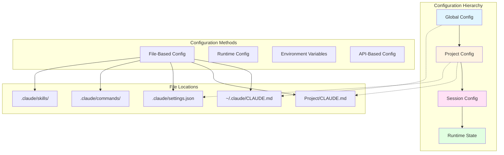

# Claude Code Configuration System

## Overview

This document provides a comprehensive reference for configuring Claude Code across different scopes and methods.

## Configuration Architecture



## Key Configuration Locations

### Global Configuration
- **Path**: `~/.claude/CLAUDE.md`
- **Scope**: All Claude Code sessions across all projects
- **Use Cases**: Personal preferences, default behaviors, global standards
- **Priority**: Lowest (overridden by project config)

### Project Configuration
- **Path**: `<project-root>/CLAUDE.md`
- **Scope**: Specific project only
- **Use Cases**: Project-specific rules, team standards, codebase conventions
- **Priority**: High (overrides global config)

### Claude Settings
- **Path**: `.claude/settings.json`
- **Scope**: Project-level configuration
- **Use Cases**: Structured settings, tool configurations, feature flags
- **Priority**: Medium

### Commands Directory
- **Path**: `.claude/commands/`
- **Scope**: Custom slash commands
- **Use Cases**: Project-specific workflows, automation shortcuts
- **Priority**: N/A (additive)

### Skills Directory
- **Path**: `.claude/skills/`
- **Scope**: Reusable capabilities and workflows
- **Use Cases**: Complex multi-step operations, domain-specific expertise
- **Priority**: N/A (additive)

## File-Based Configuration

### CLAUDE.md Format

Both global and project CLAUDE.md files use Markdown with these conventions:

```markdown
# Section Title

## Subsection

Key instructions in natural language.

### Do's and Don'ts
- DO: Preferred behavior
- DON'T: Avoided behavior

### Code Examples
```language
example code
```
```

### Common CLAUDE.md Sections

1. **Code Review Requirements**
   - When to request reviews
   - Review process workflow
   - Approval criteria

2. **File Management**
   - Directory structure rules
   - Naming conventions
   - File creation permissions

3. **Git Commit Messages**
   - Format requirements
   - Attribution rules
   - Conventional commit standards

4. **Code Style Preferences**
   - Language-specific standards
   - Formatting rules
   - Anti-patterns to avoid

5. **Documentation Guidelines**
   - What to document
   - Where to document
   - Documentation standards

6. **Communication Standards**
   - Response format
   - Anti-sycophancy rules
   - Error handling

### settings.json Structure

```json
{
  "project": {
    "name": "Project Name",
    "type": "web|cli|library|api"
  },
  "tools": {
    "enabled": ["tool1", "tool2"],
    "disabled": ["tool3"]
  },
  "features": {
    "autoReview": true,
    "testRunner": "pytest|jest|go test"
  },
  "paths": {
    "scratch": "scratch/",
    "tests": "tests/",
    "docs": "docs/"
  }
}
```

### Commands Structure

Each command is a Markdown file in `.claude/commands/`:

```markdown
---
name: command-name
description: Brief description
category: workflow|testing|docs
---

# Command Name

Detailed instructions for Claude to execute this command.

## Parameters
- param1: Description
- param2: Description

## Steps
1. Step one
2. Step two
```

### Skills Structure

Skills are directories containing:
- `skill.md` - Main skill definition
- Supporting files (templates, examples)
- Metadata and documentation

## Runtime Configuration

### Session Context

Runtime state maintained during Claude Code session:
- Current working directory
- Active git branch
- Todo list state
- File modification history
- Tool usage patterns

### Dynamic Preferences

Set during conversation:
- Verbosity level
- Confirmation requirements
- Output format preferences
- Error handling strategy

## Environment Variables

### System Environment Variables

Claude Code respects these environment variables:

| Variable | Purpose | Example |
|----------|---------|---------|
| `EDITOR` | Default text editor | `vim`, `code` |
| `SHELL` | Shell for bash commands | `/bin/bash` |
| `PATH` | Tool availability | `/usr/local/bin:...` |
| `HOME` | User home directory | `/Users/username` |

### Project-Specific Variables

Can be referenced in commands and workflows:
- `PROJECT_ROOT` - Project base directory
- `GIT_BRANCH` - Current git branch
- Language-specific (e.g., `PYTHONPATH`, `NODE_ENV`)

## API-Based Configuration

### MCP (Model Context Protocol) Servers

Configured in MCP settings (typically `~/.config/claude/mcp.json`):

```json
{
  "mcpServers": {
    "server-name": {
      "command": "executable",
      "args": ["arg1", "arg2"],
      "env": {
        "VAR": "value"
      }
    }
  }
}
```

### Tool Configuration

MCP tools can be configured with:
- Authentication credentials
- API endpoints
- Rate limits
- Feature flags

### Common MCP Servers

1. **GitHub** - Repository operations
2. **Supabase** - Database management
3. **Linear** - Project management
4. **Chrome DevTools** - Browser automation
5. **Perplexity** - AI search
6. **Exa Search** - Web research

## Configuration Precedence

When multiple configuration sources exist:

1. **Runtime session commands** (highest)
2. **Project CLAUDE.md**
3. **Project .claude/settings.json**
4. **Global ~/.claude/CLAUDE.md**
5. **Default behaviors** (lowest)

## Best Practices

### Do's
- Keep global config minimal and universally applicable
- Use project CLAUDE.md for team-wide standards
- Document configuration decisions
- Version control project configs
- Test configuration changes incrementally

### Don'ts
- Don't duplicate settings across levels
- Don't put secrets in CLAUDE.md files
- Don't override without documenting why
- Don't create configs that conflict across levels
- Don't over-configure - start minimal

## Troubleshooting Configuration

### Config Not Applied
1. Check file location and naming
2. Verify Markdown syntax
3. Check precedence rules
4. Review session context

### Conflicting Configs
1. Identify which level has priority
2. Remove or consolidate duplicates
3. Document resolution in higher-priority config

### Unknown Behavior
1. Check all config levels
2. Review recent changes
3. Test with minimal config
4. Enable verbose logging

## Reference Links

- [MCP Setup Reference](~/claude-references/mcp-setup.md)
- [Port Management](~/claude-references/port-management.md)
- [Network Infrastructure](~/claude-references/network-infrastructure.md)
- [API Key Management](~/claude-references/1password-api-keys.md)
